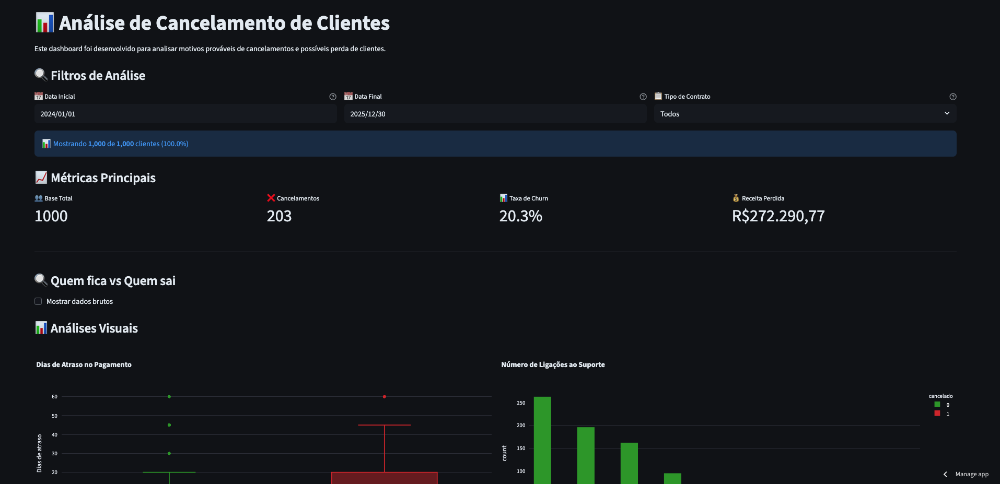
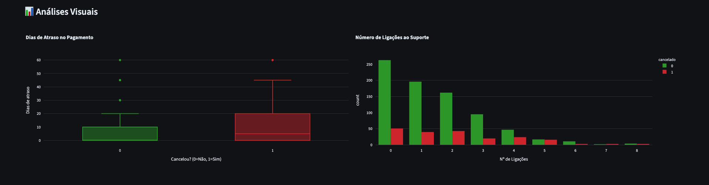
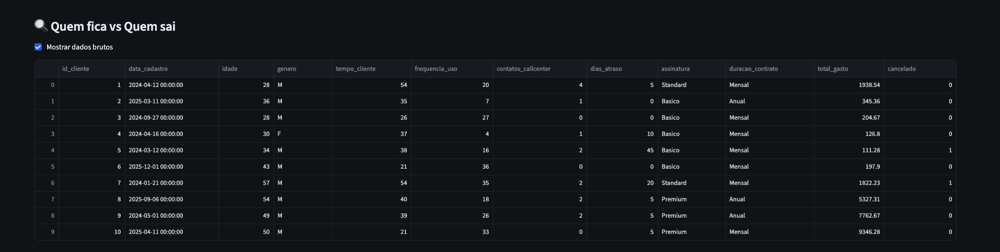
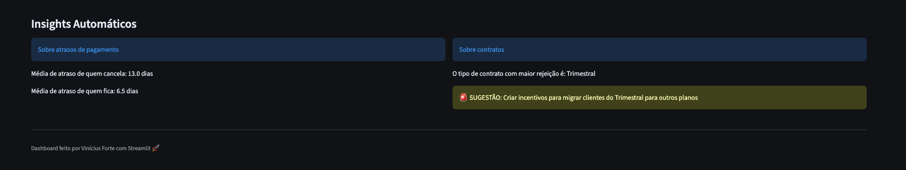
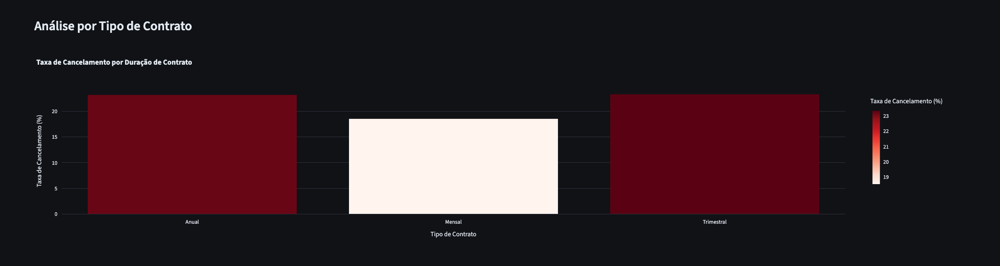
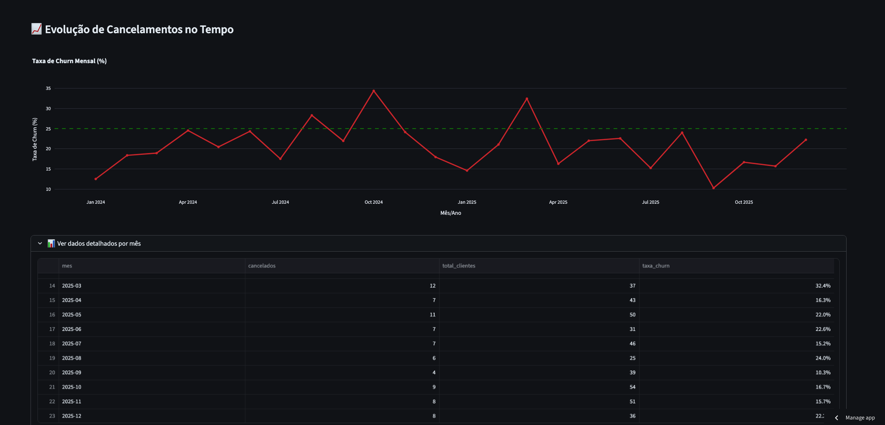
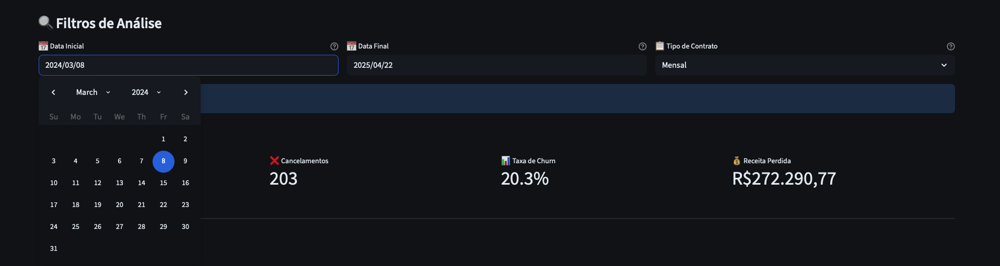

# 📊 Churn Analysis Dashboard (EN)

---

> Interactive dashboard developed in Python and hosted on Streamlit Cloud for Churn analysis and forecasting, enabling the identification of attrition patterns and customer retention optimization.

🔗 **[Access the online dashboard](https://dashboard-churn.streamlit.app)**

---

## 🎯 Project Overview

This project was developed to provide companies with a clear, data-driven understanding of service cancellation causes. The dashboard enables:

- Real-time **Churn Rate** monitoring.
- Identification of key **churn drivers** and predictors.
- **Revenue Leakage** analysis.
- Automated **insight generation** for data-informed decision-making.

---

## 📸 Preview



> *Executive overview featuring core KPIs.*

---

## ✨ Key Features

### 📈 KPIs

> High-level metrics: Total Customers, Total Cancellations, Churn Rate, and Lost Revenue.



### 🎲 Raw Data Access

> Optional drill-down view of the underlying dataset.



### 💭 Automated Insights

> Heuristic-based insights that flag critical patterns and suggest actionable items.



### 📊 Interactive Visualizations

- **Payment Delay Analysis**: Box Plots comparing overdue days between active and churned customers.
- **Support Center Interaction**: Histograms correlating support ticket frequency with attrition.
- **Churn by Contract Type**: Bar charts identifying high-risk contract tiers.



### 🔼 Time-Series Evolution

> Timeline tracking monthly churn trends against defined business targets/benchmarks.



### 🎛️ Dynamic Controls & Filtering

- **Date Range Picker**: Custom temporal window selection.
- **Contract Filters**: Granular analysis by contract type (Monthly, Quarterly, Annual).
- **Client-side Validation**: Built-in logic to prevent invalid date ranges or empty queries.



---

## 🛠️ Tech Stack


---

## 📂 Project Structure

```
projeto-churn/
├── .devcontainer/           # Containerized dev environment
│   └── devcontainer.json    # Docker-based DevContainer config
│
├── .streamlit/              # Streamlit-specific configuration
│   └── config.toml          # Theming and server settings
│
├──assets/                   # Static assets 
│  └── screenshots/          # Application screenshots
│
├── data/                    # Data persistence layer
│   └── cancelamentos.csv    # Generated customer dataset
│
├── src/                     # Source code
│   ├── __init__.py          # Package initializer
│   └── gerador_base.py      # Synthetic data generator script
│
├── tests/                   # Automated test suite
│   ├── __init__.py  
│   ├── test_calculos.py     # Unit tests for business logic/math
│   └── test_validacoes.py   # Data validation and integrity tests
│
├── .gitignore               # Git exclude patterns
├── LICENSE                  # Project license
├── README_EN.MD             # English Doc
├── README.md                # Documentation
├── requirements.txt         # Dependency manifest
└── streamlit_app.py         # Application entry point
```

---

## 💻 Roadmap

- [ ] Integrate Machine Learning models for predictive churn scoring.
- [ ] Implement automated threshold-based alerting system.
- [ ] Exportable reporting (PDF/Excel formats).
- [ ] User Authentication (RBAC).
- [ ] Production database integration (PostgreSQL).

---

## 🚀 Getting Started

### Prerequisites

- Python 3.11 or higher
- pip (Python package manager)
- Git

### Installation & Setup

#### 1. Clone the repository

```bash
git clone https://github.com/vininoronha21/projeto-churn.git
cd projeto-churn
```

#### 2. Configure Virtual Environment (Recommended)

```bash
# Create venv
python -m venv venv

# Activate on Windows:
venv\Scripts\activate

# Activate on Linux/Mac:
source venv/bin/activate
```

#### 3. Install Dependencies

```bash
pip install -r requirements.txt
```

#### 4. Run Data Generator

```bash
python gerador_base.py
```

Expected output:

```
✅ Dataset generated successfully!
📁 Saved at: {output_path}
📊 Total Customers: {XXXX}
📅 Date Range: {XXXX-XX-XX} to {XXXX-XX-XX}
```

This populates `data/cancelamentos.csv` with synthetic customer data.

#### 5. Launch the Dashboard

```bash
streamlit run streamlit_app.py
```

---

## 🧪 Running Tests

```bash
# Execute full test suite
pytest

# Verbose mode
pytest -v

# Code coverage report
pytest --cov=src tests/

# Target specific test modules
pytest tests/test_calculos.py -v
```

**Sample Output:**

```
================================ test session starts =================================
collected 15 items

tests/test_calculos.py ..........                                              [ 66%]
tests/test_validacoes.py .....                                                 [100%]

================================ 15 passed in 0.23s ==================================
```

---

## 📚 References

### Official Documentation

- [Streamlit](https://docs.streamlit.io/)
- [Pandas](https://pandas.pydata.org/docs/)
- [Plotly](https://plotly.com/python/)
- [Pytest](https://docs.pytest.org/)

---

## 📝 License

This project is licensed under the MIT License. See the [LICENSE](LICENSE) file for details.

---

## 👨‍💻 Author

Developed by **Vinícius Forte**

- 🐙 GitHub: [vininoronha21](https://github.com/vininoronha21)
- 💼 LinkedIn: [Vinícius Noronha](https://linkedin.com/in/viniciusnoronha)
- 📧 Email: contatovininoronha@gmail.com
