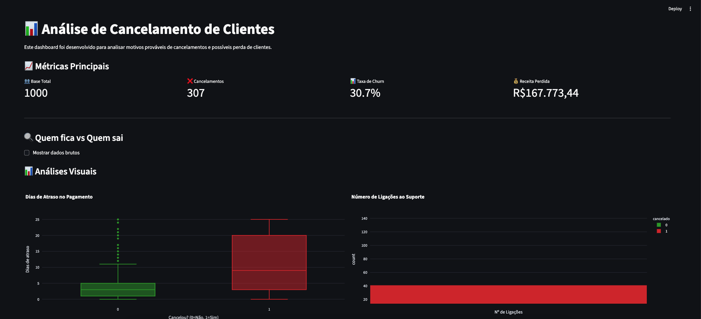
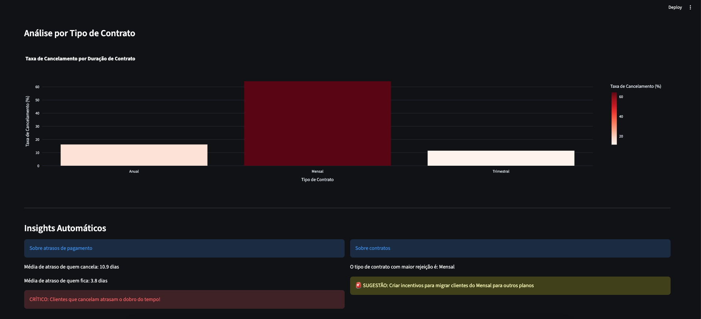

# 📊 Dashboard de Análise de Churn - Previsão de Cancelamento de Clientes

> Dashboard interativo desenvolvido em Python para análise e previsão de Churn, permitindo identificar padrões de cancelamento e reduzir a perda de clientes.

## 🎯 Sobre o projeto

Este projeto nasceu da necessidade das empresas compreenderem, de forma clara e objetiva, as causas do cancelamento de seus serviços. O dashboard desenvolvido permite:

- Visualizar a taxa de churn em tempo real
- Identificar os principais fatores que levam ao cancelamento
- Analisar a receita perdida
- Gerar insights automáticos para tomada de decisão

## 🖼️ Preview do Dashboard



> *Visão geral do dashboard com KPIs principais.*

## 💡 Funcionalidades

## 📈 KPIs

- Total de clientes ativos
- Taxa de churn mensal/anual
- Receita perdida por cancelamento

## 🔍 Análises Detalhadas



> - *Análise de atraso de pagamento*
> - *Análise de suporte ao cliente*
> - *Segmentação para identificar grupos de alto risco*
> - *Insights automáticos*

## 🛠️ Tecnologias Utilizadas

- **Python 3.9+** -> Linguagem principal
- **Streamlit** -> Framework para rodar o dashboard
- **Pandas** -> Manipulação e análise de dados
- **Plotly Express** -> Visualizações intuitivas
- **Numpy** -> Operações numéricas

## 📁 Estrutura do Projeto

```
projeto-churn/
│
├── data/                    # Dados brutos e processados
│   ├── cancelamentos.csv    # Dataset de exemplo
│   └── gerador_base.py      # Gerador de Dataset
│
├── src/                    # Código fonte
│   └── app.py              # Aplicação principal Streamlit
│
├── assets/                 # Imagens para documentação
│   └── screenshots/  
│
├── requirements.txt        # Dependências do projeto
├── .gitignore
├── LICENSE      
└── README.md       
```

## 🚀 Como Executar

## Pré-requisitos

- Python 3.9 ou superior
- pip instalado

## Caso queira gerar bases diferentes para testar

1. No terminal/prompt de comando, navegue até a pasta 'data'

```bash
cd caminho/para/sua/pasta
```

2. Rode o gerador para criar o CSV

```bash
python gerador_base.py
```

Você vai ver uma mensagem tipo:

```
✅ Arquivo 'cancelamentos.csv' gerado com sucesso!
📊 Total de registros: 1000
❌ Clientes cancelados: 450
📈 Taxa de churn: 45.0%
```

## Instalação

1. Clone o repositório

```bash
git clone https://github.com/vininoronha21/projeto-churn.git
cd projeto-churn
```

2. Crie um ambiente virtual (recomendado)

```bash
python -m venv venv
source venv/bin/activate
```

3. Instale as dependências

```bash
pip install -r requirements.txt
```

4. Execute o dashboard

```bash
streamlit run src/app.py
```

## 📚 Melhorias Futuras

- [ ] Implementar modelo de Machine Learning para previsão de churn
- [ ] Adicionar filtros de data personalizáveis
- [ ] Criar sistema de alertas automáticos
- [ ] Adicionar exportação de relatórios em PDF

## 👨‍💻 Autor

**Desenvolvido por Vinicius Noronha Forte**

- LinkedIn: https://linkedin.com/in/viniciusnoronha
- Email: [contatovininoronha@gmail.com]

## 📝 Licença

Este projeto está sob a licença MIT. Veja o arquivo [LICENSE](LICENSE) para mais detalhes.

---

# 📊 Churn Analysis Dashboard

> Interactive dashboard developed in Python for Churn analysis and forecasting, enabling the identification of cancellation patterns and the reduction of customer loss.

## 🎯 About the Project

This project was developed based on the necessity for companies to clearly and objectively understand the causes of service cancellation (Churn). The developed dashboard allows for:

- Visualizing the churn rate in real-time
- Identifying the main factors that lead to cancellation
- Analyzing lost revenue
- Get automated, actionable insights for better decision-making.

## 🖼️ Dashboard Preview


> * *Dashboard overview with key KPIs.*

## 💡 What's Inside?

## 📈 KPIs

- Total Active Customer Count
- Monthly/Annual Churn Rate
- Revenue Lost to Cancellations

## 🔍 Detailed Analysis


> - *Late Payment Breakdown*
> - *Customer Support Interaction Analysis*
> - *High-Risk Customer Segmentation (Who's likely to bail?)*
> - *Automated Insight Generation*

## 🛠️ Tech Stack

- **Python 3.9+** -> Main programming language
- **Streamlit** -> Framework for running the interactive dashboard
- **Pandas** -> Data manipulation and analysis
- **Plotly Express** -> Intuitive and interactive visualizations
- **Numpy** -> Numerical operations

## 📁 Project Structure

```
projeto-churn/
│
├── data/                    # Raw and processed data
│   ├── cancelamentos.csv    # Test dataset
│   └── gerador_base.py      # Dataset Generator
│
├── src/                    # Source Code
│   └── app.py              # Main Application
│
├── assets/                 # Images
│   └── screenshots/  
│
├── requirements.txt        # Dependencies
├── .gitignore
├── LICENSE  
└── README.md   
```

## 🚀 How to Run

## Prerequisites

- Python 3.9 or higher
- pip installed

## If you want to generate different datasets for testing

1. In the terminal/command prompt, navigate to the 'data' folder

```bash
cd path/to/your/folder
```

2. Run the generator to create the CSV file

```bash
python gerador_base.py
```

You will see a message like:

```
✅ Arquivo 'cancelamentos.csv' gerado com sucesso!
📊 Total de registros: 1000
❌ Clientes cancelados: 450
📈 Taxa de churn: 45.0%
```

## Setup

1. Clone the repository

```bash
git clone https://github.com/vininoronha21/projeto-churn.git
cd projeto-churn
```

2. Create a virtual environment (recommended)

```bash
python -m venv venv
source venv/bin/activate
```

3. Install dependencies

```bash
pip install -r requirements.txt
```

4. Launch the dashboard

```bash
streamlit run src/app.py
```

## 📚 What's Next? (Future Plans)

- [ ] Implement a full Machine Learning prediction model
- [ ] Add dynamic, custom date filters
- [ ] Build an automatic alert system
- [ ] Include PDF export options for easy reporting

## 👨‍💻 Author

**Developed by Vinicius Noronha Forte**

- Connect on LinkedIn: https://linkedin.com/in/viniciusnoronha
- Email me: [contatovininoronha@gmail.com]

## 📝 License

This project is released under the MIT License. Check the [LICENSE](https://www.google.com/search?q=LICENSE) file for all the details.
